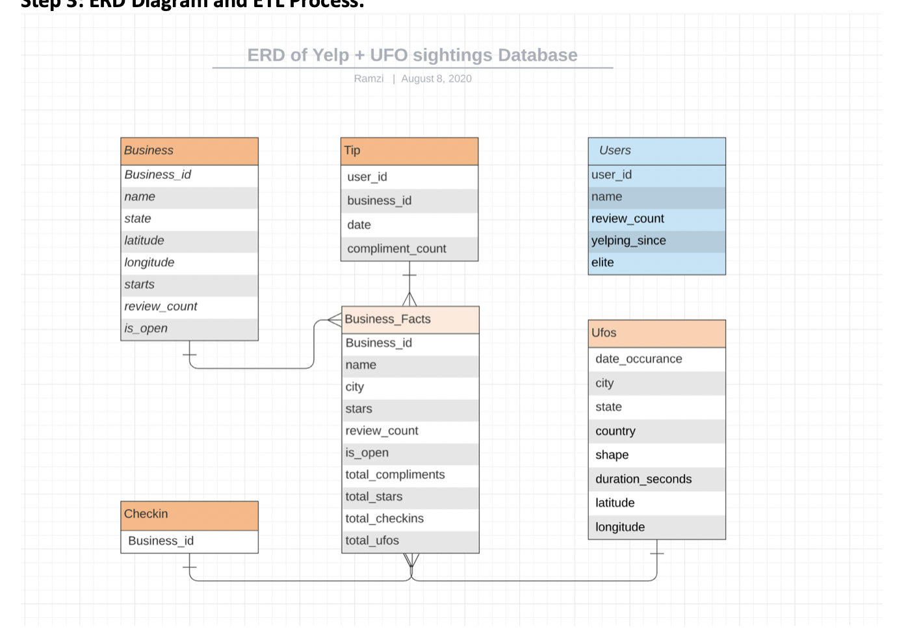
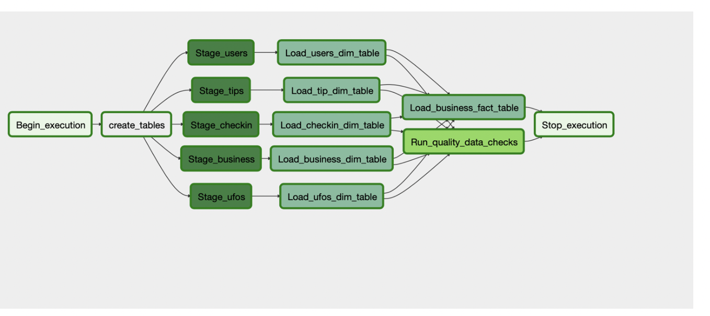

# Data Engineering Capstone: Udacity
Capstone for Udacity Data Engineering Program

My hypothetical new startup is a an extra-terrestrial themed bakery named “Martin Marshmallow” that is doing really well in our local area. We see a strong relationship due to our area having a lot of UFO sightings and extra-terrestrial events reported along with recent unclassified UFO/extraterrestrial documents that were officially released.

*	We just raised some venture funding to expand our reach to other parts of the country, but we want to validate where our next store locations would be.  
*	As the technical cofounder and sole data engineer I want to build a warehouse of restaurants/bakeries that do well and enrich it with data that is similar theme of our current bakery. 
*	We have collected some starter data from Yelp’s publicly accessible data and some UFO
 sighting data to begin our product market fit validation to new locations.
 
## Resources: 

* Yelp Data: 
https://www.kaggle.com/yelp-dataset/yelp-dataset

* UFO Data: 
https://www.kaggle.com/camnugent/ufo-sightings-around-the-world

* Boto to S3: 
https://gist.github.com/msharp/eaa1c5b1b4e50f1372c19bbe5ef52f9e
https://dev.to/razcodes/how-to-copy-files-to-s3-using-boto3-41fp

* Docker File: 
https://github.com/puckel/docker-airflow

## Files Includes:

* Data Exploration Jupyter Notebook
* Docker Compose File for Airlfow
* Airflow Dags, Plugins, Opeartors 
* Boto to S3 File

## Steps To Recreate Process:
1. Run Docker Compose File
2. Add Airflow Dags, Plugins, Opeartors Files
3. Add Data Files to S3 (From Above Source After Cleaning) (Using Boto to S3 or Manually) 
4. Run Dags Hours/Daily etc. d

## Steps needed for the ETL Process: 
1.	Create and S3 Bucket and Redshift Warehouse in the same region 
2.	Add Files to S3 Bucket 
a.	Using Boto 3 documented code found below 
b.	Manually upload to S3 Bucket. 
3.	Create an Airflow Instance
a.	Locally on a machine
b.	Using Docker
4.	Write the Airflow DAGS, Helpers and Operators.
5.	Begin Testing ETL Workflow as Errors and issues occur in the DAG’s in airflow cont. to edit and refine the process. 
6.	Finalize the process and being loading data in the set interval needed. 

## ERD of Data 

## Data Flow in Airflow

## Succesfull Dag Runs

